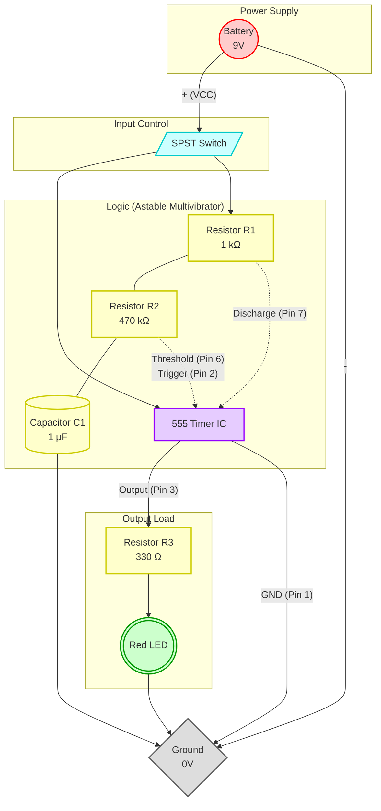

# 555 Timer LED Flasher Circuit

```mermaid
flowchart TD
    %% Define Styles
    classDef power fill:#ffcccc,stroke:#ff0000,stroke-width:2px;
    classDef control fill:#ccffff,stroke:#00cccc,stroke-width:2px;
    classDef IC fill:#e6ccff,stroke:#9900ff,stroke-width:2px;
    classDef passive fill:#ffffcc,stroke:#cccc00,stroke-width:2px;
    classDef output fill:#ccffcc,stroke:#009900,stroke-width:2px;
    classDef ground fill:#dddddd,stroke:#666666,stroke-width:2px;

    %% Components
    subgraph Power_Supply ["Power Supply"]
        B((Battery<br>9V)):::power
    end
    
    subgraph Input ["Input Control"]
        S1[/SPST Switch/]:::control
    end
    
    subgraph Processing ["Logic (Astable Multivibrator)"]
        IC1[555 Timer IC]:::IC
        R1[Resistor R1<br>1 kΩ]:::passive
        R2[Resistor R2<br>470 kΩ]:::passive
        C1[(Capacitor C1<br>1 µF)]:::passive
    end
    
    subgraph Output_Stage ["Output Load"]
        R3[Resistor R3<br>330 Ω]:::passive
        LED1(((Red LED))):::output
    end
    
    GND{Ground<br>0V}:::ground

    %% Connections
    B -- "+ (VCC)" --> S1
    S1 --> IC1
    S1 --> R1
    
    R1 --- R2
    R2 --- C1
    C1 --> GND
    
    %% Timer Logic Connections
    R1 -. "Discharge (Pin 7)" .-> IC1
    R2 -. "Threshold (Pin 6)<br>Trigger (Pin 2)" .-> IC1
    
    %% Output Connections
    IC1 -- "Output (Pin 3)" --> R3
    R3 --> LED1
    LED1 --> GND
    
    %% Ground Return
    IC1 -- "GND (Pin 1)" --> GND
    B -- "-" --> GND
```
